
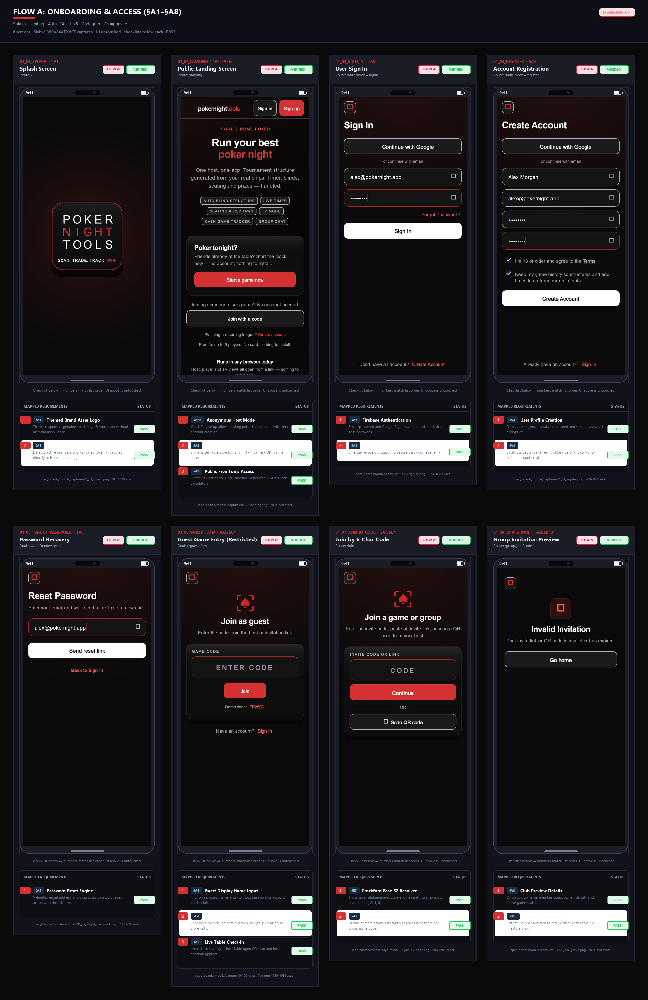
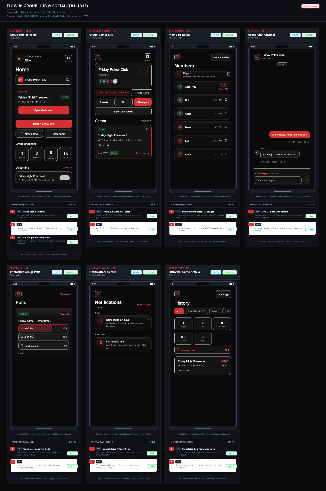
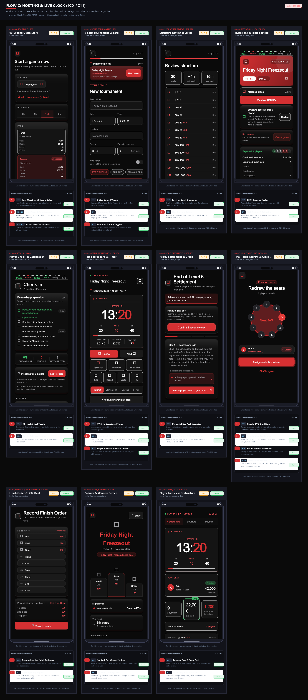
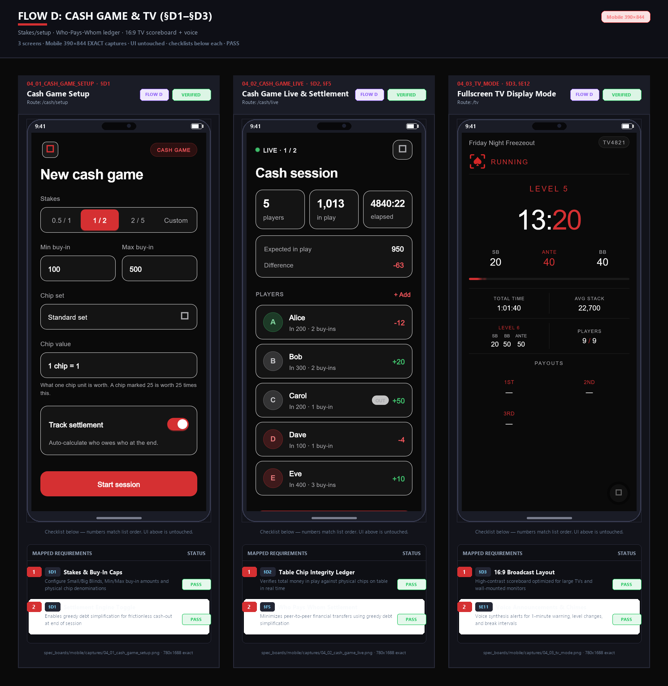
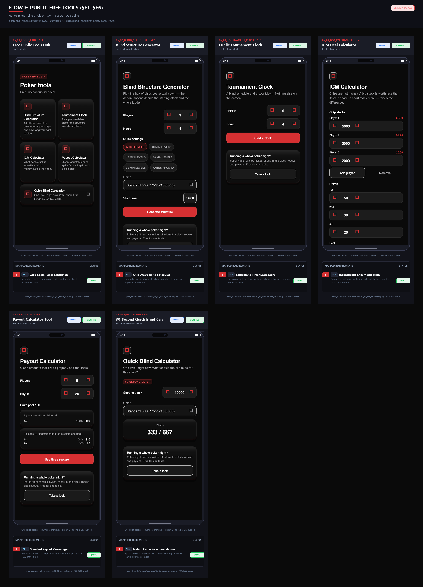
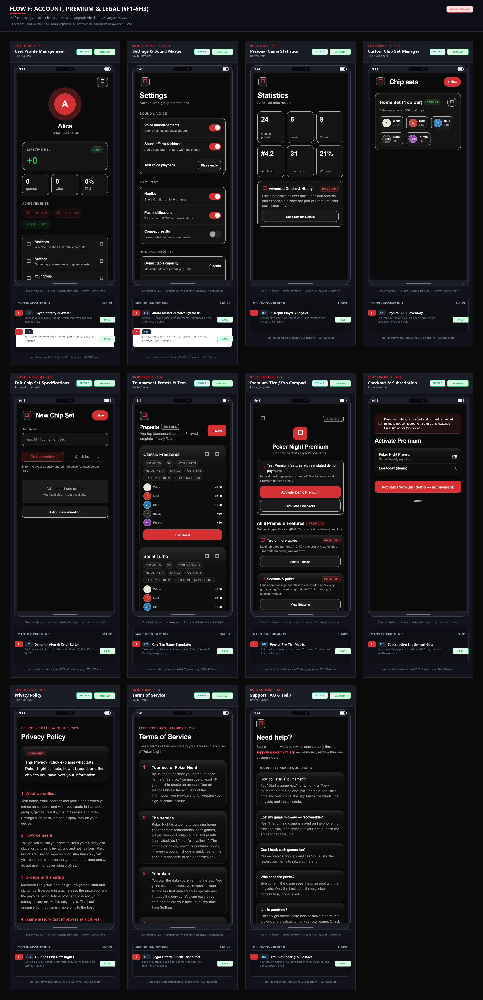

# Poker Night — Complete Combined Specification (Reformed Flow Architecture)

> **Document Version:** 3.1-Reformed · 2 October 2026  
> **Source Base:** Consolidated from all 111 pages of *Build Specification v3.1*, *Addendum 1*, *Addendum 2*, and *General Poker Tournament Structuring Framework*.  
> **Visual Reference:** Real Flutter widget captures organized in `spec_boards/` (dual viewport: mobile 390×844 @2x & desktop 1440×900 @1x).  
> **Core Principle:** Money is not the structural unit of poker—chips, blind levels, player count, and time are.

---

## Master Architecture Board (All 46 Screens at a Glance)

Below is the complete, single-artboard visual overview of all 46 production-rendered screens across the entire product:



---

## Part 1: Design System & Architectural Rules

### 1.1 Visual Tokens
- **Background Ground:** `#0A0A0A` (Deep obsidian space).
- **Cards & Containers:** `#12131A` / `#161824` with 1px border stroke `#262836`.
- **Primary Accent:** Crimson Red `#D53032` (or `#E11D48`), with theme palette support for Blue, Green, Amber, Purple, and Obsidian.
- **Typography:** Genuine bundled `Space Grotesk` (weights 300, 400, 500, 600, 700).
- **Component Geometry:** 16px radius cards (`ListRowCard`), 38px circle avatars, frosted glass navigation bars with background blur.

### 1.2 Core Architectural Rules (Binding)
1. **Single-Layer Navigation:** No nested navigation stacks or buried drawer menus. The app uses a 5-tab floating glass bar for group members (Home, Games, Chat, Members, More) and a dedicated back-arrow pattern for wizard steps.
2. **Device-Bezel Integrity:** Screenshots on verification boards live strictly inside authentic phone bezels or laptop browser chrome. No artificial mock pins or numbers are drawn on top of the UI pixels—all annotations live in the structured checklists below each screen.
3. **Realistic Mock State:** Forms render completed, realistic test inputs (e.g. `alex@pokernight.app`, `Demo1234!`) without submitting to live backends, ensuring offline safety and clean visuals.
4. **Offline Resilience:** Active tournament states are snapshotted locally via SQLite / SecureStorage (`RecoveryService`). On an unexpected device restart, the running game resumes immediately without data loss.

---

## Part 2: Flow-by-Flow Complete Specifications

```
Flow A: Onboarding, Access & Authentication  (§A1–§A8)  -> 8 screens
Flow B: The Group Hub & Social Operations   (§B1–§B13) -> 7 screens
Flow C: Tournament Hosting & Live Clock     (§C0–§C11) -> 11 screens
Flow D: Cash Game & Living Room TV Mode     (§D1–§D3)  -> 3 screens
Flow E: Public Free Tools                   (§E1–§E6)  -> 6 screens
Flow F: Account, Settings, Presets & Legal  (§F1–§H3)  -> 11 screens
Total: 46 Production Code Screens
```

---

# FLOW A: Onboarding, Access & Authentication

**Purpose:** Provides immediate, frictionless entry for three user archetypes: returning club members, new players joining a friend's poker night, anonymous home hosts who want to run a quick tournament tonight without an account, and invited guests scanning a table QR code.

### Overall Flow A Visual Board



### Screen-by-Screen Specifications (Flow A)

#### §A1 · 01_01 Splash (`/`)
- **Visuals:** Responsive vector spade brand logo + wordmark face with smooth 3D card flip animation.
- **Route Guard (§C3):** Inspects cached Firebase auth tokens and local group bundles on cold start:
  * Authenticated members with an active group $\rightarrow$ navigate directly to `/home`.
  * Authenticated users with no groups $\rightarrow$ navigate to `/landing`.
  * Unauthenticated visitors $\rightarrow$ navigate to `/landing`.

#### §A2 · 01_02 Public Landing (`/landing`)
- **Anonymous Host Mode ("Start a game now", §A2b):** Lets a host set up and run a tournament tonight with zero account creation or signup required.
- **Join Table Entry:** Direct 6-character Crockford code input box and camera QR code scanner shortcut.
- **Free Tools Gateway:** Instant one-tap navigation to the 5 public free poker calculators.

#### §A3 · 01_03 User Sign In (`/auth?mode=signin`)
- **Authentication Providers:** Email/password and one-tap Google Sign-In with persistent device tokens.
- **Form State:** Pre-populated with realistic dummy data (`alex@pokernight.app` / `••••••••`) with password visibility eye-toggle.
- **Account Recovery:** Direct link to password reset flow without full page reloads.

#### §A4 · 01_04 Account Registration (`/auth?mode=register`)
- **Profile Fields:** Full name (`Alex Morgan`), email (`alex@pokernight.app`), password, and password confirmation with inline validation.
- **Legal Gate (§E15):** Two explicit checkboxes:
  1. *Mandatory:* "I'm 18 or older and agree to the Terms" (blocking signup if unchecked).
  2. *Optional:* "Keep my game history so structures and end times learn from our real nights".

#### §A5 · 01_05 Password Recovery (`/auth?mode=reset`)
- **Recovery Engine:** Single email input field with anti-spam throttle limits.
- **Feedback:** "If an account exists for this email, a reset link is on its way."

#### §A6 · 01_06 Guest Table Flow (`/guest-flow`)
- **Frictionless Entry:** Simple display name input; no password, email, or credentials required.
- **Strict Guest Shell Mode N5 (§C4):** Guests see only their table, seat, stack, and personal clock. Host administrative drawers, club creation, and billing are completely hidden.

#### §A7 · 01_07 Join by Code (`/join`)
- **Crockford Base-32 Engine (§E7):** 6-character alphanumeric room codes omitting ambiguous characters (`I`, `L`, `O`, `U`, `0`, `1`) to prevent confusion when read aloud across a room.
- **QR Viewfinder:** Mobile camera scanner resolving table codes in under 1 second.

#### §A8 · 01_08 Group Invitation Preview (`/group/join/:code`)
- **Club Preview Card:** Displays club name ("Friday Poker Club"), owner avatar, member count, and active game preview.
- **One-Tap Join Action (§B13):** Adds the player to the club roster and redirects to the home feed.

---

# FLOW B: The Group Hub & Social Operations

**Purpose:** The central social hub for recurring home games. Features a single-layer navigation structure with a 5-tab floating glass bar. Houses scheduled tournaments, active live game banners, member administration, group chat with automated game bots, scheduling polls, and push notifications.

### Overall Flow B Visual Board



### Screen-by-Screen Specifications (Flow B)

#### §B1 · 02_01 Home Hub (`/home`)
- **Club Switcher:** Top dropdown allowing seamless switching between multiple poker clubs.
- **Quick Action Hero:** Prominent action button to start a 60-second tournament or cash game session.
- **5-Tab Glass Bottom Bar (§C1):** Floating navigation with frosted blur background: Home, Games, Chat, Members, and More.

#### §B2 · 02_02 Group Games Hub (`/group/games`)
- **Active Table Banner:** Running live games are highlighted at the top with level, blinds, and timer summary.
- **Scheduled & Past Games:** Lists upcoming game dates and links to archived tournament records.
- **Game Launcher:** Dedicated CTAs for "Host Tournament" and "Start Cash Game".

#### §B3 · 02_03 Member Directory (`/group/members`)
- **Roster & Hierarchy (§E6):** Displays member initials avatars, names, role badges (Host, Admin, Member), and performance stats.
- **Invite Share Sheet:** Generates group invite links and QR codes for new member onboarding.

#### §B4 · 02_04 Live Chat Stream (`/group/chat`)
- **Player Messaging:** Real-time messaging stream with sender avatars and timestamps.
- **Automated Broadcast Bot (§E10):** System bot automatically announces level increases, break countdowns, rebuy closes, and player eliminations directly in the stream.

#### §B5 · 02_05 Scheduling Polls (`/group/polls`)
- **Poll Creation:** Multi-option voting polls for picking game nights (e.g. "When should we play next Friday?").
- **Auto-Schedule Integration:** Closing a winning poll option automatically drafts a scheduled tournament for that date.

#### §B6 · 02_06 Notification Center (`/group/notifications`)
- **Activity Feed:** Push alerts for game countdowns ("Game starts in 1 hour"), RSVP deadlines, and finish results.
- **OneSignal Sync:** Tracks read/unread state synced with native device push notification services.

#### §B7 · 02_07 Game History & Archives (`/group/history`)
- **Chronological Logs:** Cards showing past tournament winners, prize money, and turnout counts.
- **Elimination Drill-Down (§E14):** Deep records of knockout sequences, individual payouts, and season leaderboard points.

---

# FLOW C: Tournament Hosting, Live Clock & Deals

**Purpose:** The flagship tournament engine. Supports 60-second quick play or deep 5-step custom wizards, TDA table balancing, drift-free TV clock with host pause/undo controls, dynamic rebuy expansions, Final Table circular SVG countdown ring, and mathematical Malmuth-Harville ICM chip deals.

### Overall Flow C Visual Board



### Screen-by-Screen Specifications (Flow C)

#### §C0 · 03_00 Quick Start Tournament (`/tournament/quick-start`)
- **4-Question 60s Setup:** Asks only player count, target hours, buy-in ($), and chip set.
- **Structure Engine (§F1):** Auto-calculates starting stacks ($B_0 = X / 100$), generates the blind ladder, and launches the live clock in 2 taps.

#### §C1 · 03_01 Custom Tournament Wizard (`/tournament/create`)
- **5-Step Architecture:**
  1. *Basics & Venue:* Name, date, time, location, target duration.
  2. *Chip Inventory:* Physical chip box selection.
  3. *Buy-In & Economics:* Buy-in ($), rebuy rules, add-on bonus, knockout (KO) bounties.
  4. *Structure Pacing:* Level duration, ante introduction, break frequency.
  5. *Invitations:* RSVP roster limits and deadlines.
- **Lock Rules (§E8):** Buy-in, rebuy cost, add-on cost, and KO bounty freeze permanently once posted.

#### §C2 · 03_02 Structure Review & Editor (`/tournament/structure`)
- **Blind Schedule Ladder:** Level-by-level editor (SB, BB, Ante, duration) with chip denomination validation.
- **Live Duration Estimator (§F1):** Adding breaks or changing level times instantly recalculates the estimated finish time.

#### §C3 · 03_03 Seating & RSVPs (`/tournament/invitation`)
- **RSVP Tracking:** Live breakdown across Going, Maybe, and Can't attend states.
- **TDA Seating & Balancing (§F3):** Automated table balancing adhering to TDA rules (no two tables differ by more than 1 player at any time).

#### §C4 · 03_04 Physical Check-In (`/tournament/check-in`)
- **Arrival Gate:** Host marks physical player arrivals and collects cash/digital buy-ins.
- **Chip Stack Lock (§E8):** When the first player receives chips, starting chip stacks and denominations lock permanently.

#### §C5 · 03_05 Admin Dashboard Clock (`/tournament/live/admin`)
- **Drift-Free Clock Scoreboard (§F4):** Giant digital timer, current/next blinds, chip averages, and level indicator.
- **Host Time Controls:** Single-tap pause/resume, +1m, and −1m instant adjustments with full undo capability.
- **Bust-Out Drawer:** Records player elimination, finish place, and "Knocked out by" attribution for KO bounty tracking.

#### §C6 · 03_06 Rebuy Settlement (`/tournament/live/rebuys`)
- **Dynamic Prize Pool:** Tracks rebuys and add-ons per player, automatically expanding the total prize money in real time.
- **Rebuy Period Lock:** Automatically locks rebuys once the designated level (e.g. Level 6) concludes.

#### §C7 · 03_07 Final Table Mode (`/tournament/live/final-table`)
- **Circular SVG Countdown Ring:** High-visibility radial timer ring showing level progression and seconds remaining.
- **Chip Leaderboard:** Real-time stack counts and big blind depths for remaining finalists.
- **Restricted Declare Winner (Addendum 1):** "Declare Winner" action is strictly disabled while >2 players remain to prevent accidental tournament termination.

#### §C8 · 03_08 Complete Tournament & ICM Deals (`/tournament/complete`)
- **Malmuth-Harville ICM Engine (§F2):** Computes exact equity payouts for remaining players based on stack distributions and prize pool tiers during deal negotiations.
- **Finish Order Adjustment:** Drag-to-reorder interface allowing the host to correct finish positions prior to finalizing payout distribution.

#### §C9 · 03_09 Result Podium (`/tournament/podium`)
- **Podium Ceremony:** Gold, silver, and bronze podium cards celebrating the top 3 finishers, total cash won, and KO bounties earned.
- **Season Standings Sync (§E14):** Automatically commits final points and ROI to the club's season leaderboard.

#### §C10 · 03_10 Player Live Spectator View (`/tournament/live/player`)
- **Personal Spectator Card:** Shows the player their assigned table number, seat number, and current stack size.
- **Read-Only Blind Ladder:** Live view of current blinds and upcoming levels without administrative buttons.

---

# FLOW D: Cash Game & Living Room TV Mode

**Purpose:** Comprehensive management for cash games and living-room spectator broadcasts. Reconciles cash stakes, tracks table chip balances, solves "Who Pays Whom" debt settlement with zero math arguments, and provides a 16:9 fullscreen TV clock.

### Overall Flow D Visual Board



### Screen-by-Screen Specifications (Flow D)

#### §D1 · 04_01 Cash Game Setup (`/cash/setup`)
- **Stakes Configuration:** Small blind, big blind, min/max buy-in limits (e.g. $1/$2 blinds, $100 min / $300 max buy-in).
- **Settlement Ledger:** Toggle enabling automatic chip-to-currency reconciliation upon game finish.

#### §D2 · 04_02 Cash Game Live Table (`/cash/live`)
- **Live Chip Integrity Ledger:** Validates that total player buy-ins equal total chips currently on the table plus cashed-out funds.
- **Greedy Debt Minimization ("Who Pays Whom", §F5):** Computes the minimal transaction paths ($\mathcal{O}(N \log N)$) between net debtors and net creditors upon session close, completely eliminating payment arguments.

#### §D3 · 04_03 Fullscreen TV Spectator Mode (`/tv/:code`)
- **16:9 Living Room Broadcast (§E12):** Designed specifically for TVs and projectors with ultra-large typography and high-contrast level indicator.
- **Audio Chimes & TTS Alerts (§E11):** 1-minute warning bell, level-up sound effect, and synthesized speech announcing upcoming blinds.

---

# FLOW E: Public Free Tools (Zero-Login Hub)

**Purpose:** Five free, standalone poker calculators accessible by anyone directly on the web or in the app with zero login or account creation required.

### Overall Flow E Visual Board



### Screen-by-Screen Specifications (Flow E)

#### §E1 · 05_01 Public Tools Hub (`/tools`)
- **Zero-Login Gateway:** Directory of the 5 free calculators with soft prompts into the full app.

#### §E2 · 05_02 Blind Structure Generator (`/tools/blinds`)
- **Chip-Aware Math (§F1):** Generates playable blind ladders customized to standard 300-chip and 500-chip home poker boxes without manual math.

#### §E3 · 05_03 Standalone Tournament Clock (`/tools/clock`)
- **Quick Game Clock:** Simple countdown timer with level adjustments, breaks, and audio alert bells for quick home games without club management.

#### §E4 · 05_04 ICM Equity Calculator (`/tools/icm`)
- **Malmuth-Harville Model (§F2):** Computes exact monetary equity based on stack sizes and remaining prize payouts.

#### §E5 · 05_05 Payout Structure Calculator (`/tools/payouts`)
- **Tiered Prize Distributions (§F2):** Standard tournament payout curves for fields ranging from 2 players up to 100+ players.

#### §E6 · 05_06 Quick Blind Recommender (`/tools/quick-blind`)
- **Instant 30s Recommendation:** Returns suggested starting blinds and level duration given desired game length and player count.

---

# FLOW F: Account, Settings, Presets, Upgrade & Legal

**Purpose:** User identity, personal career analytics, audio and voice preferences, physical chip inventory management, tournament templates, Pro subscription upgrades, and complete GDPR/CCPA legal compliance.

### Overall Flow F Visual Board



### Screen-by-Screen Specifications (Flow F)

#### §F1 · 06_01 Player Profile (`/profile`)
- **Career Stats:** Tracks total tournaments played, win count, podium finishes, and knockout count.

#### §F2 · 06_02 Settings (`/settings`)
- **Audio & Voice Master (§E11):** Toggles for 1-minute warning chime, level-up sound, and speech synthesizer volume.
- **Theme Palette Selector (§B1):** Switches between Crimson Red, Blue, Green, Amber, Purple, and Obsidian color themes.

#### §F3 · 06_03 Stats Analytics (`/stats`)
- **Performance Insights (§E14):** In-The-Money (ITM) finish percentage, average finish position (4.2), and elimination trends.

#### §F4 · 06_04 Chip Sets Inventory (`/chip-sets`)
- **Hardware Inventory:** Stores your actual physical chip sets so tournament wizards never generate impossible blind denominations.

#### §F5 · 06_05 Edit Chip Set (`/chip-sets/edit`)
- **Denomination Editor:** Custom color assignments, numeric values (e.g. 25, 100, 500, 1000), and chip quantities.

#### §F6 · 06_06 Tournament Presets (`/presets`)
- **One-Tap Templates:** Reusable configuration templates (Turbo, Deepstack, Bounty Night) for instant hosting.

#### §G1 · 07_01 Pro Upgrade (`/upgrade`)
- **Feature Matrix:** Free vs. Pro comparison highlighting unlimited clubs, multi-season archives, custom TV branding, and SMS alerts.

#### §G2 · 07_02 Subscription Checkout (`/checkout`)
- **Checkout Flow:** Plan details, 7-day free trial terms, and cancellation policy.

#### §H1 · 08_02 Terms of Service (`/terms`)
- **Compliance Disclaimer:** Mandatory legal disclaimer confirming Poker Night is a home-game manager and tournament clock, not an online gambling platform.

#### §H2 · 08_01 Privacy Policy (`/privacy`)
- **GDPR & CCPA Protection (§E15):** Explicit commitment to zero ad-trackers, zero sale of personal data, and user right to erasure.

#### §H3 · 08_03 Support Center (`/support`)
- **Crash Recovery FAQ (§E9):** Explains how local state snapshots automatically restore running games (`RecoveryService`) if a device unexpectedly restarts.

---

## Part 3: Mathematical Engines & Acceptance Reference

| Engine Domain | Core Formula / Rule | Implementing Code | Verification & Tests |
| :--- | :--- | :--- | :--- |
| **Structure Engine (§F1 & Source 1)** | Opening Big Blind $B_0 = X / 100$; Total levels $L = S / (N \times B_0)$; No doubling cliffs | `TournamentEngine` ([`lib/utils/tournament_engine.dart`](file:///D:/StudioProjects/poker_night/lib/utils/tournament_engine.dart)) | 759 automated engine test vectors |
| **Payouts & Deals Engine (§F2)** | Tiered WSOP curves + Malmuth-Harville ICM chip chop equity formula | `IcmCalculator` ([`lib/utils/icm.dart`](file:///D:/StudioProjects/poker_night/lib/utils/icm.dart)) | 55 test vectors + 145 mock tests |
| **Seating Engine (§F3)** | TDA Table Balancing ($\le 1$ difference across tables); redraw on final table | `TableSettings` ([`lib/models/table_settings.dart`](file:///D:/StudioProjects/poker_night/lib/models/table_settings.dart)) | TDA rule 10 & break-redraw checks |
| **Clock Authority (§F4)** | Drift-free millisecond epoch clock; pause, +1m/-1m adjustments | `ClockSequence` ([`lib/utils/clock_sequence.dart`](file:///D:/StudioProjects/poker_night/lib/utils/clock_sequence.dart)) | Live running timer test suite |
| **Cash Game Settlement (§F5)** | Greedy minimal transaction debt resolution ($\mathcal{O}(N \log N)$) | `CashGame` ([`lib/models/cash_game.dart`](file:///D:/StudioProjects/poker_night/lib/models/cash_game.dart)) | Verified zero-sum chip ledger |
